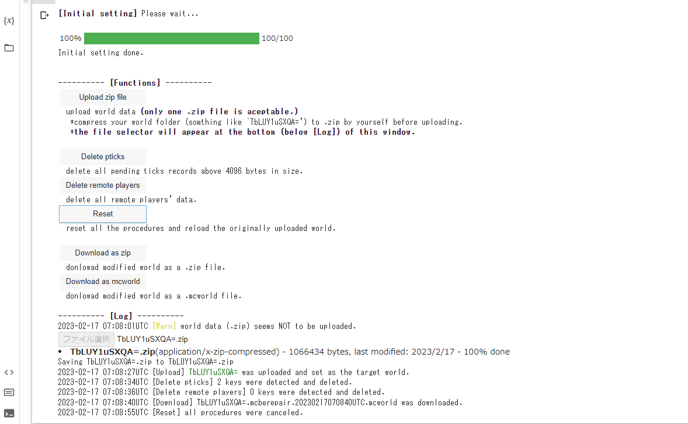

# ipy-mcbe-edit
A web-app-like interactive tool to edit Minecraft Bedrock world on Google Colab.

You can edit minecraft bedrock world data via google colab.
A few experimental functions are provided at this moment.
+ Delete pending ticks records.
+ Delete remote players' data.

 (English)
 
 

